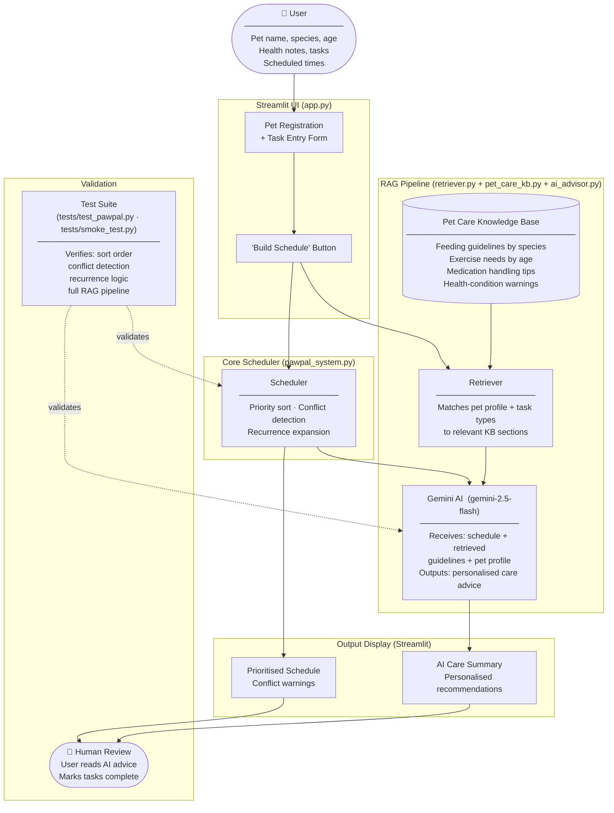

# PawPal+ System Architecture

## RAG-Enhanced Pet Care Scheduler



---

## Component Descriptions

| Component | File | Role |
|---|---|---|
| **Streamlit UI** | `app.py` | Collects pet profiles and tasks; renders the final schedule and AI advice |
| **Scheduler** | `pawpal_system.py` | Sorts tasks by priority + time, detects time-window conflicts, expands recurrences |
| **Pet Care Knowledge Base** | `pet_care_kb.py` | Static guidelines organised by species, age, task type, and health condition |
| **Retriever** | `retriever.py` | Keyword-matches the pet's profile and task types against the KB; returns the most relevant sections |
| **Gemini AI** | `ai_advisor.py` | Combines the retrieved guidelines with the built schedule to produce personalised care advice |
| **Human Review** | — | User validates AI recommendations and marks tasks done — closes the feedback loop |
| **Test Suite** | `tests/` | `test_pawpal.py` verifies scheduler logic; `smoke_test.py` validates the full RAG + AI pipeline end-to-end |

---

## Data Flow Summary

```
User Input
  └─► Streamlit UI
        ├─► Scheduler ──────────────────────────────► Prioritised Schedule ─┐
        └─► Retriever ◄── Knowledge Base                                     ├─► Human Review
              └─► Gemini AI (schedule + guidelines) ► AI Care Summary ───────┘
                                                                              ▲
                                          Test Suite ──── validates ──► Scheduler + AI layer
```
